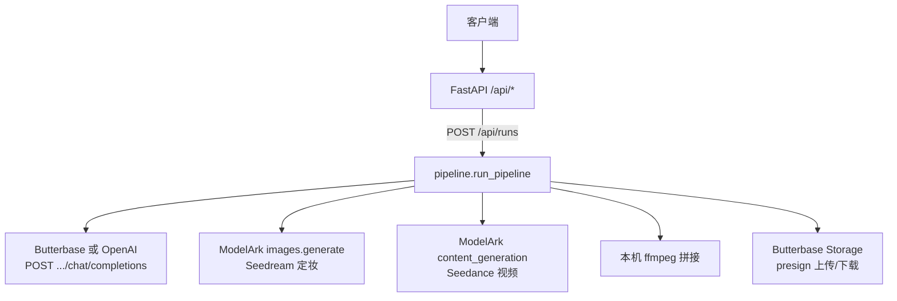

# Seedance Backend HTTP API

本仓库 **只通过 FastAPI 对外暴露 HTTP**；Butterbase（LLM + Storage）、BytePlus ModelArk（Seedream 定妆图 + Seedance 视频）、本机 **ffmpeg** 均由 **`backend/pipeline.py`** 在服务端编排调用。前端或其它客户端 **不应** 把 Ark / Butterbase 密钥发到浏览器去直连（除非单独做网关与鉴权）。

- **OpenAPI 交互文档**：服务启动后访问 [`/docs`](http://127.0.0.1:8000/docs)（Swagger UI）、[`/redoc`](http://127.0.0.1:8000/redoc)。
- **机器可读契约**：[`/openapi.json`](http://127.0.0.1:8000/openapi.json)。

---

## 架构：统一编排入口



| 能力 | 谁调用 | 实现位置（服务端） |
|------|--------|---------------------|
| 编剧 / 定妆规划 / 导演 LLM | FastAPI 后台任务 → `chat_json` | `backend/llm.py` → `httpx` |
| 定妆图 | 同上 → Ark SDK | `backend/ark_images.py` |
| 多段视频 | 同上 → Ark SDK | `seedance_video.py` |
| 拼接 | 同上 → `subprocess` + ffmpeg | `backend/pipeline.py` |
| 成片上传 | 同上 → Storage REST | `backend/butterbase_storage.py` |

编排状态落在 SQLite，通过 **`GET /api/runs/{id}`** 轮询。

---

## 路由一览

| 方法 | 路径 | 说明 |
|------|------|------|
| `GET` | `/api/health` | 探活 + `product_note` |
| `GET` | `/api/meta` | 编排说明 + 各集成是否就绪（**不含密钥**） |
| `POST` | `/api/runs` | 创建任务并 **后台** 跑完整流水线 |
| `GET` | `/api/runs/{run_id}` | 查询任务状态与各阶段 JSON 输出 |

源码目录：`backend/main.py`（挂载路由）、`backend/routers/{health,meta,runs}.py`。

---

## 1. `GET /api/health`

**作用**：探活 + 返回产品说明（`PRODUCT_NOTE_ZH`）。

**响应 `200` 示例**：

```json
{
  "ok": true,
  "product_note": "编剧约 1 分钟体量；定妆为真人向参考图；…"
}
```

---

## 2. `GET /api/meta`

**作用**：声明「所有下游均由本服务编排」；返回当前环境是否具备跑通流水线的关键条件（模型名、ffmpeg 是否可解析等）。**不返回** `BUTTERBASE_API_KEY` / `SEEDANCE_2_0_API` 等敏感信息。

**响应 `200` 示例**：

```json
{
  "orchestration": {
    "service": "seedance-backend",
    "description": "唯一编排入口：POST /api/runs 在后台依次调用 编剧(LLM)→定妆(ModelArk 图像)→导演(LLM)→多段 Seedance(视频)→ffmpeg 拼接→（可选）Butterbase Storage 上传。",
    "poll_run": "GET /api/runs/{run_id}"
  },
  "integrations": {
    "llm_chat": {
      "provider": "butterbase",
      "layer1_model": "openai/gpt-4o-mini",
      "layer2_model": "openai/gpt-4o-mini",
      "json_mode_request": false
    },
    "byteplus_modelark": {
      "api_key_configured": true,
      "video_model": "dreamina-seedance-2-0-260128",
      "makeup_image_model": "seedream-4-0-250828",
      "ark_video_base_env": "SEEDANCE_ARK_BASE_URL",
      "ark_image_base_env": "ARK_IMAGE_BASE_URL"
    },
    "ffmpeg": {
      "available": true,
      "resolved_executable": "/opt/homebrew/bin/ffmpeg",
      "config_env": "FFMPEG_PATH"
    },
    "butterbase_storage": {
      "will_upload_after_merge": true,
      "uses_same_app_and_key_as_llm": true
    }
  }
}
```

字段说明要点：

- `llm_chat.provider`：`butterbase` \| `openai` \| `none`（`none` 时创建任务后在编剧阶段会因配置报错）。
- `byteplus_modelark.api_key_configured`：是否配置了 `SEEDANCE_2_0_API`（定妆 + 视频共用）。
- `ffmpeg.available`：是否在 PATH 或 `FFMPEG_PATH` 指向可执行文件。

---

## 3. `POST /api/runs`

**作用**：创建一条流水线任务，并在 **BackgroundTasks** 中异步执行完整编排。响应仅含 `id` 与初始 `status`；**进度与结果**请轮询 `GET /api/runs/{id}`。

**请求头**：`Content-Type: application/json`

**请求体**：

| 字段 | 类型 | 约束 |
|------|------|------|
| `drama` | string | 必填，去首尾空格后 ≥ 1 字符，最大 32000 |

**响应 `200` 示例**：

```json
{
  "id": "351cefa9-89af-4c66-9393-0be1b7aeca7c",
  "status": "draft"
}
```

**错误**：

- 缺 `drama`：`422`（FastAPI 校验 `detail` 数组）。
- 仅空格：`400`，`{"detail":"drama must not be empty"}`。

---

## 4. `GET /api/runs/{run_id}`

**作用**：查询 SQLite 中该任务的当前状态与各阶段输出。

**响应 `200`**：包含 `status`、`drama_input`、`layer1_output`、`makeup_output`、`layer2_output`、`layer3_output`、`error_code`、`error_message`、`created_at`、`updated_at` 等。

**`status` 可能取值**：

| 值 | 含义 |
|----|------|
| `draft` | 已创建，后台任务即将启动 |
| `layer1_running` / `layer1_done` | 编剧 |
| `makeup_running` / `makeup_done` | 定妆 |
| `layer2_running` / `layer2_done` | 导演 |
| `layer3_running` | 多段 Seedance + ffmpeg +（可选）上传 |
| `done` | 成功 |
| `failed` | 失败（见 `error_code` / `error_message`） |

**响应 `404`**：`{"detail":"not found"}`。

---

## 集成与安全说明

- **统一入口**：业务上只应调用本文档中的 **`/api/*`**；OpenAPI 在 `/docs`。
- **无鉴权**：当前版本未挂载 API Key / JWT，仅适合本地或受信网络部署。
- **CORS**：环境变量 `CORS_ORIGINS`（默认含 Vite 开发地址）。
- **长任务**：`POST /api/runs` 立即返回；建议每 1～2 秒 `GET` 同一 `id` 直至 `done` 或 `failed`。

---

## 快速自测

```bash
BASE=http://127.0.0.1:8000

curl -sS "$BASE/api/health" | python3 -m json.tool
curl -sS "$BASE/api/meta" | python3 -m json.tool

curl -sS -X POST "$BASE/api/runs" \
  -H "Content-Type: application/json" \
  -d '{"drama":"你的故事……"}' | python3 -m json.tool

curl -sS "$BASE/api/runs/<RUN_ID>" | python3 -m json.tool
```
